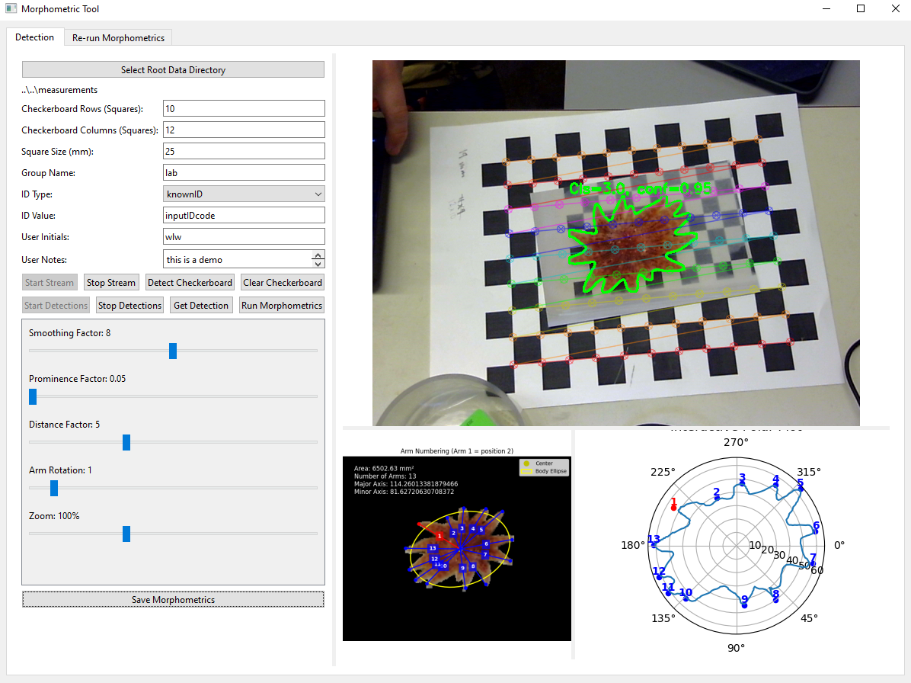

# starMorphometricTool
This is a demo of using a combination of a yolo11 instance segmentation model and opencv checkerboard calibration module to measure the area of stars, estimate arm lengths from center, and get a measurement of star shape anisotropy. Typical use of photos often relies on manual measurement of a calibration object (ruler) to get a px/measurement conversion for the image. This adds hassle and is a bit prone to error due to camera angle and lense effects. 

To use this tool the first step is to place a non-square checker board of known checker sizes and counts infront of a static camera. The tool can then be triggered to find the checkerboard, its pretty good at this, if it fails it is either (A) your input dimensions for the checker board are wrong or (B) your lighting sucks. The checkerboard MUST be flat. Then, presuming your camera does not move, you can place stars onto the checker board to measure them. NOTE the best measurements will be within the middle of the checkerboard, if the star is off the checkerboard it will fail, there will be increasing measurement error on the sides of the checker board. PLACE THE STARS IN THE MIDDLE OF THE CHECKER BOARD :) .

Behind the scenes the webcam's perspective is projected onto the checkerboard flattening then image onto it. This corrects for perspective error and provides accurate measurements if the star is in the middle of the checker board. The operation also neccesarily causes some reduction in resolution of the projected image as it is warped to the checkerboard, this is OK. 

To find the arm tips the tool uses a contour finding and peak finding algorithms, you can adjust the parameters of these models on the fly to best find the arm tips. It will only work well for long arms (small arms are usually missed) and it is important to tune the parameters, although I've chosen pretty good defaults. Segmentation quality has a bit impact on the results. You can also rotate which found arm is the first arm based on visual reference to the madreporite, if you care.



# Install instructions

### Set up anaconda env
```bash
conda create -n starMorphometricTool python=3.9 -y
conda activate starMorphometricTool
```

### Clone the Repository
First, clone this repository to your local machine:
```bash
git clone https://github.com/weertman/starMorphometricTool.git
cd starMorphometricTool
```

### Install pytorch from source
https://pytorch.org/get-started/locally/

### Install packages
```bash
pip install PySide6 opencv-python-headless ultralytics numpy matplotlib scipy
```

# Choosing a model
Currently the package uses a nano sized model by default (its ok, not great, good for demos)
if you wish to use a different model I've placed options into a dropbox folder
```bash
https://www.dropbox.com/scl/fo/gynp911wspftbuyzmoqxe/AG2gyWISAqav4282zeYvQdE?rlkey=t8ve0p8feh94i28a9669l43ov&st=wxzyixv7&dl=0
```
You will then have to manually change the path to the model path in Yolov8WebCamStreamGUI.py

```bash
# Load YOLOv8 model
path_model = os.path.join('..', '..', 'models', 'yolov8-n-pretrained.pt')
self.yolo_model = YOLO(path_model)
```
change this to..
```bash
path_model = os.path.join('PATH TO YOUR MODEL')
```

# Running the tool
The tool is currently a demo and so you can run it simply by running the python script Yolov8WebCamStreamGUI.py
e.g.,
```bash
cd starMorphometricTool
python src/starMorphometricTool/Yolov8WebCamStreamGUI.py
```

# Future TODO list

### 1. Expand list USB cameras that can work 
(e.g., GeT cameras and Basler Cameras) for higher resolution imaging. This is a bit.. complex to do and would require a fair bit of script reworking for each backend added but would make the tool more user friendly. o1 is really good at doing this :)

### 2. Add auto madreporite segmentation for body axis detection
madreporiteSegmentor now works 95% of the time, see..
```bash
https://github.com/weertman/madreporiteSegmentor
```
would be cool to add a one click auto rotation feature which the user can override if it fails.

### 3. Add volume estimation
So this is a bit speculation, and would have varying results with camera model and lighting, but under the correct conditions in theory it could work well..
Not sure, but would be fun to test.. check out..
```bash
https://github.com/apple/ml-depth-pro
```
I've tested into before in other contexts and it seems to work remarkably well, would be interesting to see how close it's measurements can be to volumetric measures.
To do this we will use the checkerboard as a distance calibration and the segmentation to cut the volume where it meets the checkerboard. This should technically be possible, the big unknown is accuracy. While the other measure of this project have prinicipled underpining (camera calibration is reliable) this method would rely on a neural network which could have varying performance with lighting, checkboard, background info etc. Infact the best images probably would be fairly high resolution with some background context to help the model 'see'.

### 4. Expand morphometric analyses within and across measurement dates

### 5. Add hidden class exclusion for working with the models (e.g., star/prey models exclude prey detections)


